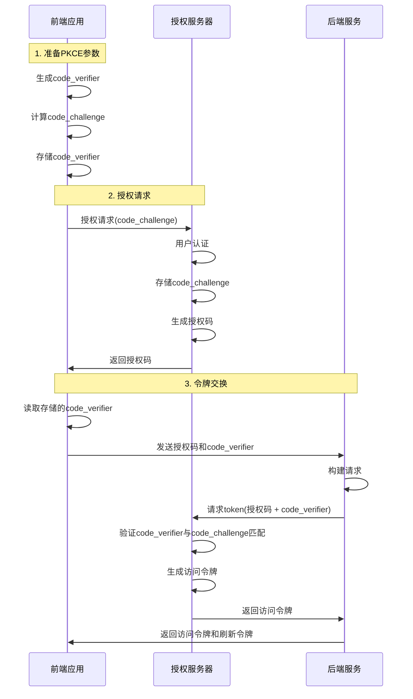

# OAuth2 PKCE 认证实现指南

## 1. PKCE概述

PKCE (Proof Key for Code Exchange) 是OAuth2授权码流程的安全扩展，通过添加动态生成的challenge/verifier对，防止授权码拦截攻击，特别适用于无法安全存储客户端密钥的场景。

## 2. PKCE流程图



## 3. 配置要求

### 3.1 数据库配置

在`oauth2_registered_client`表中修改以下字段:

```sql
UPDATE oauth2_registered_client SET 
  client_authentication_methods = 'none',
  client_settings = JSON_SET(client_settings, '$.settings.client.require-proof-key', true),
  token_settings = JSON_SET(token_settings, '$.settings.client.require-proof-key', true)
WHERE client_id = 'webapp-client';
```

### 3.2 YAML配置

#### SSO服务端配置:
```yaml
spring:
  security:
    oauth2:
      authorization-server:
        client:
          webapp-client:
            require-proof-key: true
```

#### Admin客户端配置:
```yaml
spring:
  security:
    oauth2:
      client:
        registration:
          webapp-client:
            client-id: ${CLIENT_ID:webapp-client}
            # 【重要】client-authentication-method配置在registration下
            client-authentication-method: none
            authorization-grant-type: authorization_code
            redirect-uri: "${baseUrl}/oauth2/callback"
            scope: openid,profile,email
        provider:
          webapp-client:
            # 注意：不要在provider下配置client-authentication-method
            authorization-uri: https://example.com/oauth2/authorize
            token-uri: https://example.com/oauth2/token
            jwk-set-uri: https://example.com/oauth2/jwks
            user-info-uri: https://example.com/userinfo
```

## 4. 前端实现

### 4.1 PKCE工具函数 (pkceUtils.ts)

```typescript
/**
 * PKCE认证工具类
 */
export class PKCEUtils {
  private static STORAGE_KEY = 'pkce_code_verifier';
  
  /**
   * 生成指定长度的随机字符串
   */
  static generateRandomString(length: number): string {
    const charset = 'ABCDEFGHIJKLMNOPQRSTUVWXYZabcdefghijklmnopqrstuvwxyz0123456789-._~';
    let result = '';
    const values = new Uint8Array(length);
    window.crypto.getRandomValues(values);
    for (let i = 0; i < length; i++) {
      result += charset[values[i] % charset.length];
    }
    return result;
  }
  
  /**
   * Base64-URL编码
   */
  static base64UrlEncode(str: Uint8Array): string {
    const base64 = window.btoa(String.fromCharCode(...new Uint8Array(str)));
    return base64
      .replace(/\+/g, '-')
      .replace(/\//g, '_')
      .replace(/=+$/, '');
  }
  
  /**
   * 从code_verifier生成code_challenge
   */
  static async generateCodeChallenge(codeVerifier: string): Promise<string> {
    const encoder = new TextEncoder();
    const data = encoder.encode(codeVerifier);
    const hashBuffer = await window.crypto.subtle.digest('SHA-256', data);
    return this.base64UrlEncode(new Uint8Array(hashBuffer));
  }
  
  /**
   * 生成PKCE参数
   */
  static async generatePKCEParams(): Promise<{ codeVerifier: string, codeChallenge: string, codeChallengeMethod: string }> {
    // 建议长度为 43-128 字符
    const codeVerifier = this.generateRandomString(96);
    const codeChallenge = await this.generateCodeChallenge(codeVerifier);
    
    return {
      codeVerifier,
      codeChallenge,
      codeChallengeMethod: 'S256'
    };
  }
  
  /**
   * 存储code_verifier
   */
  static storeCodeVerifier(codeVerifier: string): void {
    sessionStorage.setItem(this.STORAGE_KEY, codeVerifier);
  }
  
  /**
   * 获取code_verifier
   */
  static getCodeVerifier(): string | null {
    return sessionStorage.getItem(this.STORAGE_KEY);
  }
  
  /**
   * 清除code_verifier
   */
  static clearCodeVerifier(): void {
    sessionStorage.removeItem(this.STORAGE_KEY);
  }
}
```

### 4.2 登录流程实现 (Login.tsx)

```typescript
import { PKCEUtils } from '../utils/pkceUtils';

export const Login: React.FC = () => {
  // 获取配置信息，判断是否启用PKCE
  const [config, setConfig] = useState<{ enablePkce: boolean }>({ enablePkce: false });
  
  useEffect(() => {
    // 获取OAuth2配置
    fetch('http://localhost:9001/api/oauth2/config')
      .then(response => response.json())
      .then(data => setConfig(data))
      .catch(error => console.error('获取配置失败:', error));
  }, []);

  const handleLogin = async () => {
    // 构建授权请求参数
    const params = new URLSearchParams({
      response_type: 'code',
      client_id: 'webapp-client',
      scope: 'read openid profile write',
      state: crypto.randomUUID(),
      redirect_uri: 'http://localhost:8081/oauth2/callback'
    });

    // 如果启用PKCE，添加相关参数
    if (config.enablePkce) {
      try {
        const { codeVerifier, codeChallenge, codeChallengeMethod } = await PKCEUtils.generatePKCEParams();
        
        // 存储code_verifier以在回调时使用
        PKCEUtils.storeCodeVerifier(codeVerifier);
        
        // 添加PKCE参数
        params.append('code_challenge', codeChallenge);
        params.append('code_challenge_method', codeChallengeMethod);
        
        console.log('使用PKCE模式登录');
      } catch (error) {
        console.error('生成PKCE参数失败:', error);
      }
    }

    // 跳转到授权页面
    window.location.href = `https://example.com/oauth2/authorize?${params.toString()}`;
  };

  return (
    <div className="login-container">
      <button onClick={handleLogin}>
        {config.enablePkce ? 'PKCE安全登录' : '标准登录'}
      </button>
    </div>
  );
};
```

### 4.3 授权码回调处理 (Callback.tsx)

```typescript
import { PKCEUtils } from '../utils/pkceUtils';

export const OAuthCallback: React.FC = () => {
  useEffect(() => {
    const handleCallback = async () => {
      // 从URL获取授权码和state
      const params = new URLSearchParams(window.location.search);
      const code = params.get('code');
      const state = params.get('state');
      
      if (!code) {
        console.error('授权失败: 未获取到授权码');
        return;
      }
      
      try {
        // 获取之前存储的code_verifier
        const codeVerifier = PKCEUtils.getCodeVerifier();
        
        // 交换token
        const response = await fetch('http://localhost:9001/api/oauth2/token', {
          method: 'POST',
          headers: {
            'Content-Type': 'application/json'
          },
          body: JSON.stringify({
            code,
            state,
            clientId: 'webapp-client',
            codeVerifier: codeVerifier
          })
        });
        
        if (!response.ok) {
          throw new Error(`获取令牌失败: ${response.status}`);
        }
        
        const data = await response.json();
        
        // 存储令牌并清理code_verifier
        localStorage.setItem('access_token', data.access_token);
        localStorage.setItem('refresh_token', data.refresh_token);
        PKCEUtils.clearCodeVerifier();
        
        // 重定向到首页
        window.location.href = '/dashboard';
      } catch (error) {
        console.error('处理回调失败:', error);
      }
    };
    
    handleCallback();
  }, []);
  
  return <div>正在处理认证，请稍候...</div>;
};
```

## 5. 后端实现

### 5.1 OAuth2配置控制器

```java
@RestController
@RequestMapping("/api/oauth2")
public class OAuth2ConfigController {

    @GetMapping("/config")
    public Map<String, Object> getConfig() {
        // 返回PKCE配置
        return Map.of("enablePkce", true);
    }
}
```

### 5.2 授权控制器

```java
@RestController
@RequestMapping("/api/oauth2")
@Slf4j
public class OAuth2AuthorizeController {

    private final OAuth2ClientService oauth2ClientService;
    
    public OAuth2AuthorizeController(OAuth2ClientService oauth2ClientService) {
        this.oauth2ClientService = oauth2ClientService;
    }
    
    @PostMapping("/token")
    public ResponseEntity<?> exchangeToken(@RequestBody TokenRequest tokenRequest) {
        log.debug("收到令牌交换请求: {}", tokenRequest);
        
        try {
            // 检测是否包含code_verifier参数，决定使用PKCE方式
            if (StringUtils.hasText(tokenRequest.getCodeVerifier())) {
                log.debug("检测到PKCE流程，code_verifier: {}...(已省略)", 
                    tokenRequest.getCodeVerifier().substring(0, 5));
            }
            
            // 交换令牌
            TokenResponse tokenResponse = oauth2ClientService.exchangeToken(
                tokenRequest.getCode(),
                tokenRequest.getState(),
                tokenRequest.getClientId(),
                tokenRequest.getCodeVerifier()
            );
            
            return ResponseEntity.ok(tokenResponse);
        } catch (Exception e) {
            log.error("交换令牌失败", e);
            return ResponseEntity.status(HttpStatus.UNAUTHORIZED)
                .body(Map.of("error", "获取token失败"));
        }
    }
}

@Data
public class TokenRequest {
    private String code;
    private String state;
    private String clientId;
    private String codeVerifier;
}
```

### 5.3 OAuth2客户端服务

```java
@Service
@Slf4j
public class OAuth2ClientService {
    
    @Value("${oauth2.server.token-uri}")
    private String tokenEndpoint;
    
    private final RestTemplate restTemplate;
    
    public OAuth2ClientService(RestTemplate restTemplate) {
        this.restTemplate = restTemplate;
    }
    
    public TokenResponse exchangeToken(String code, String state, String clientId, String codeVerifier) {
        if (StringUtils.hasText(codeVerifier)) {
            return exchangeTokenWithPkce(code, state, clientId, codeVerifier);
        } else {
            // 备用逻辑，如果需要支持非PKCE模式
            throw new UnsupportedOperationException("只支持PKCE模式");
        }
    }
    
    private TokenResponse exchangeTokenWithPkce(String code, String state, String clientId, String codeVerifier) {
        log.debug("检测到codeVerifier，使用PKCE方式交换令牌");
        
        HttpHeaders headers = new HttpHeaders();
        headers.setContentType(MediaType.APPLICATION_FORM_URLENCODED);
        
        MultiValueMap<String, String> params = new LinkedMultiValueMap<>();
        params.add("grant_type", "authorization_code");
        params.add("code", code);
        params.add("redirect_uri", "http://localhost:8081/oauth2/callback");
        params.add("client_id", clientId);
        params.add("code_verifier", codeVerifier);
        params.add("state", state);
        
        log.debug("添加code_verifier参数: {}...(已省略)", codeVerifier.substring(0, 5));
        log.debug("发送PKCE请求到token端点: {}", tokenEndpoint);
        
        HttpEntity<MultiValueMap<String, String>> request = new HttpEntity<>(params, headers);
        
        try {
            ResponseEntity<TokenResponse> response = restTemplate.exchange(
                tokenEndpoint,
                HttpMethod.POST,
                request,
                TokenResponse.class
            );
            
            return response.getBody();
        } catch (HttpClientErrorException e) {
            log.error("PKCE获取token时发生HTTP错误: {}", e.getMessage());
            throw e;
        }
    }
}

@Data
public class TokenResponse {
    private String access_token;
    private String token_type;
    private String refresh_token;
    private long expires_in;
    private String id_token;
    private String scope;
}
```

## 6. 实现要点与注意事项

### 6.1 配置位置说明

**重要提示**：在Spring Security OAuth2配置中，`client-authentication-method`的正确位置是在`client.registration.webapp-client`下，而不是在`provider`下。

✅ 正确的配置位置：
```yaml
spring:
  security:
    oauth2:
      client:
        registration:
          webapp-client:
            client-authentication-method: none  # 正确位置
```

❌ 错误的配置位置：
```yaml
spring:
  security:
    oauth2:
      client:
        provider:
          webapp-client:
            client-authentication-method: none  # 错误位置
```

### 6.2 完整实施清单

✅ 数据库配置更新
  - client_authentication_methods = 'none'
  - client_settings中设置require-proof-key = true
  - token_settings中设置require-proof-key = true

✅ YAML配置正确设置
  - registration.webapp-client.client-authentication-method: none
  - registration.webapp-client.redirect-uri配置正确

✅ 前端实现
  - 实现PKCE代码生成和验证逻辑
  - 正确存储和传递code_verifier

✅ 后端实现
  - 添加支持PKCE的token交换逻辑
  - 处理没有Basic认证的请求

✅ 测试流程
  - 确保授权码和token正确交换
  - 验证无需Basic认证也能成功获取token

### 6.3 常见问题排查

1. **401 Unauthorized错误**:
   - 检查客户端认证方法配置是否正确
   - 确认数据库中client_authentication_methods已设置为'none'
   - 检查YAML配置位置是否正确（在registration下而不是provider下）

2. **invalid_grant错误**:
   - 检查授权码是否已过期或已被使用
   - 确认redirect_uri参数与授权请求中使用的完全一致
   - 验证code_verifier是否正确传递

3. **code_verifier验证失败**:
   - 检查前端code_verifier生成和存储是否正确
   - 确保Base64-URL编码实现符合规范
   - 检查code_challenge_method是否一致（应为'S256'）

## 7. 安全建议

1. 使用足够长的code_verifier (最少43字符，推荐96字符以上)
2. 始终使用S256方法而非plain方法计算code_challenge
3. 存储code_verifier时使用sessionStorage而非localStorage，增强安全性
4. 每次授权请求生成新的state参数，防止CSRF攻击
5. 实施适当的错误处理和日志记录，但不要泄露敏感信息

## 8. 常见错误配置

1. **同时使用PKCE和Basic认证**：
   如果同时配置了client-authentication-method: basic和PKCE，系统会要求两种认证同时通过，这往往不是预期行为。

2. **配置位置错误**：
   将client-authentication-method错误地配置在provider下而不是registration下。

3. **数据库和YAML配置不一致**：
   数据库中的client_authentication_methods与YAML中的client-authentication-method配置不一致。

4. **缺少redirect_uri参数**：
   在token交换请求中忘记包含redirect_uri参数。即使使用PKCE，该参数仍是必需的。